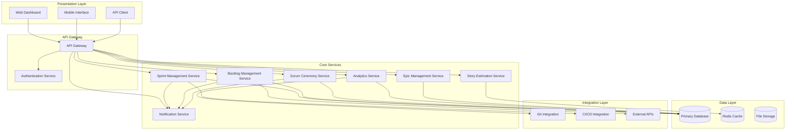

# Agile Project Management System Design

## Overview

The Agile Project Management System is a comprehensive platform designed to support scrum-based development workflows for the Healthcare Competitive Intelligence Platform. The system provides end-to-end agile project management capabilities including sprint planning, backlog management, scrum ceremonies, progress tracking, and team analytics.

The system follows a microservices architecture with clear separation of concerns, enabling scalability and maintainability. It integrates seamlessly with existing development tools while providing rich dashboards and analytics for stakeholders at all levels.

## Architecture

### High-Level Architecture

The system employs a layered microservices architecture with the following key layers:

1. **Presentation Layer**: Web-based dashboards and mobile-responsive interfaces
2. **API Gateway Layer**: Centralized API management and routing
3. **Service Layer**: Core business logic microservices
4. **Data Layer**: Persistent storage and caching
5. **Integration Layer**: External tool integrations and webhooks

### System Components



## Correctness Properties

*A property is a characteristic or behavior that should hold true across all valid executions of a system-essentially, a formal statement about what the system should do. Properties serve as the bridge between human-readable specifications and machine-verifiable correctness guarantees.*

**Property 1: Sprint creation consistency**
*For any* valid sprint parameters (dates, team, capacity), creating a sprint should result in a sprint object with all required fields properly initialized and capacity correctly calculated based on team availability
**Validates: Requirements 1.1, 1.2**

**Property 2: Sprint activation integrity**
*For any* valid sprint and selected backlog items, activating the sprint should move all selected items to the sprint while maintaining referential integrity and notifying all team members
**Validates: Requirements 1.3**

**Property 3: Story validation consistency**
*For any* user story input, the validation process should consistently apply INVEST criteria and acceptance criteria completeness checks, rejecting invalid stories and accepting valid ones
**Validates: Requirements 2.1**

**Property 4: Priority ordering preservation**
*For any* sequence of story reordering operations, the final priority order should reflect the intended sequence with no gaps or duplicates in priority numbers
**Validates: Requirements 2.2**

**Property 5: Dependency acyclicity**
*For any* set of story dependencies, the system should detect and prevent circular dependency chains while allowing valid dependency relationships
**Validates: Requirements 2.4**

**Property 6: Estimation session integrity**
*For any* planning poker session, the system should collect all participant votes before revealing results and correctly calculate consensus using Fibonacci sequence values
**Validates: Requirements 3.1, 3.3**

**Property 7: Progress reporting completeness**
*For any* standup progress report, the system should capture and store all required fields (yesterday's work, today's plan, blockers) with proper timestamps and user attribution
**Validates: Requirements 4.2**

**Property 8: Burndown calculation accuracy**
*For any* sprint state, burndown calculations should accurately reflect remaining story points against ideal trajectory with mathematically correct projections
**Validates: Requirements 5.1**

**Property 9: Velocity calculation consistency**
*For any* team sprint history, rolling velocity calculations should produce consistent results using the same time window and properly handle edge cases like incomplete sprints
**Validates: Requirements 5.2**

**Property 10: Epic progress aggregation**
*For any* epic with associated stories, progress percentage should accurately reflect the completion state of all child stories with proper handling of story point weighting
**Validates: Requirements 6.2**

**Property 11: Dashboard data integrity**
*For any* project state, stakeholder dashboards should display consistent and up-to-date information with all metrics properly calculated and formatted
**Validates: Requirements 7.1**

**Property 12: Action item lifecycle consistency**
*For any* retrospective action item, the system should maintain complete lifecycle tracking from creation through completion with proper owner assignment and status updates
**Validates: Requirements 8.2**

**Property 13: Integration synchronization integrity**
*For any* external system integration event, the system should maintain data consistency between internal state and external tools without data loss or corruption
**Validates: Requirements 9.1**

**Property 14: Analytics calculation accuracy**
*For any* team performance data, calculated metrics (cycle time, lead time, throughput) should be mathematically correct and consistent across different time periods
**Validates: Requirements 10.1**

## Components and Interfaces

### Sprint Management Service

**Responsibilities:**
- Sprint lifecycle management (creation, activation, completion)
- Capacity planning and allocation
- Sprint goal definition and tracking
- Sprint metrics calculation

**Key Interfaces:**
```typescript
interface SprintService {
  createSprint(sprintData: SprintCreationRequest): Promise<Sprint>
  activateSprint(sprintId: string): Promise<void>
  completeSprint(sprintId: string): Promise<SprintSummary>
  calculateCapacity(teamId: string, sprintDuration: number): Promise<Capacity>
  updateSprintGoals(sprintId: string, goals: string[]): Promise<void>
}

interface Sprint {
  id: string
  name: string
  startDate: Date
  endDate: Date
  capacity: number
  goals: string[]
  status: SprintStatus
  teamId: string
  stories: UserStory[]
}
```

### Backlog Management Service

**Responsibilities:**
- User story creation and management
- Story prioritization and ordering
- Epic decomposition and traceability
- Dependency management
- Story readiness validation

**Key Interfaces:**
```typescript
interface BacklogService {
  createUserStory(storyData: UserStoryRequest): Promise<UserStory>
  prioritizeStories(storyIds: string[], priorities: number[]): Promise<void>
  decomposeEpic(epicId: string): Promise<UserStory[]>
  validateDependencies(storyId: string, dependencies: string[]): Promise<ValidationResult>
  assessStoryReadiness(storyId: string): Promise<ReadinessScore>
}

interface UserStory {
  id: string
  title: string
  description: string
  acceptanceCriteria: string[]
  storyPoints: number
  priority: number
  status: StoryStatus
  epicId?: string
  dependencies: string[]
  assignee?: string
}
```

### Story Estimation Service

**Responsibilities:**
- Planning poker session management
- Estimation collection and consensus
- Historical estimation data
- Reference story management

**Key Interfaces:**
```typescript
interface EstimationService {
  startPlanningPoker(storyId: string, participants: string[]): Promise<EstimationSession>
  submitEstimate(sessionId: string, userId: string, estimate: number): Promise<void>
  calculateConsensus(sessionId: string): Promise<ConsensusResult>
  getHistoricalEstimates(storyPattern: string): Promise<ReferenceStory[]>
}

interface EstimationSession {
  id: string
  storyId: string
  participants: Participant[]
  estimates: Map<string, number>
  status: SessionStatus
  consensusReached: boolean
  finalEstimate?: number
}
```

### Scrum Ceremony Service

**Responsibilities:**
- Daily standup management
- Sprint review coordination
- Retrospective facilitation
- Action item tracking

**Key Interfaces:**
```typescript
interface CeremonyService {
  scheduleStandup(teamId: string, schedule: StandupSchedule): Promise<void>
  recordStandupUpdate(userId: string, update: StandupUpdate): Promise<void>
  createRetrospective(sprintId: string): Promise<Retrospective>
  addActionItem(retrospectiveId: string, actionItem: ActionItem): Promise<void>
  trackActionProgress(actionItemId: string, progress: number): Promise<void>
}

interface StandupUpdate {
  userId: string
  yesterday: string
  today: string
  blockers: string[]
  timestamp: Date
}
```

### Analytics Service

**Responsibilities:**
- Velocity calculation and trending
- Burndown chart generation
- Team performance metrics
- Predictive analytics

**Key Interfaces:**
```typescript
interface AnalyticsService {
  calculateVelocity(teamId: string, sprintCount: number): Promise<VelocityData>
  generateBurndownChart(sprintId: string): Promise<BurndownChart>
  getTeamMetrics(teamId: string, timeframe: TimeFrame): Promise<TeamMetrics>
  predictSprintCompletion(sprintId: string): Promise<CompletionPrediction>
}

interface VelocityData {
  averageVelocity: number
  velocityTrend: number[]
  confidenceInterval: [number, number]
  recommendedCapacity: number
}
```

## Data Models

### Core Entities

```typescript
// Team and User Management
interface Team {
  id: string
  name: string
  members: TeamMember[]
  scrumMaster: string
  productOwner: string
  capacity: number
  workingDays: number[]
}

interface TeamMember {
  userId: string
  role: TeamRole
  capacity: number
  availability: AvailabilityPeriod[]
}

// Sprint and Story Management
interface Epic {
  id: string
  title: string
  description: string
  businessValue: string
  acceptanceCriteria: string[]
  stories: string[]
  status: EpicStatus
  targetRelease?: string
}

interface UserStory {
  id: string
  epicId?: string
  title: string
  description: string
  acceptanceCriteria: string[]
  storyPoints?: number
  priority: number
  status: StoryStatus
  assignee?: string
  reporter: string
  labels: string[]
  dependencies: string[]
  createdAt: Date
  updatedAt: Date
}

// Sprint Management
interface Sprint {
  id: string
  name: string
  teamId: string
  startDate: Date
  endDate: Date
  capacity: number
  goals: string[]
  status: SprintStatus
  stories: string[]
  metrics: SprintMetrics
}

interface SprintMetrics {
  plannedPoints: number
  completedPoints: number
  addedPoints: number
  removedPoints: number
  velocity: number
  burndownData: BurndownPoint[]
}

// Ceremony and Process Management
interface Retrospective {
  id: string
  sprintId: string
  facilitator: string
  participants: string[]
  wentWell: RetroItem[]
  couldImprove: RetroItem[]
  actionItems: ActionItem[]
  conductedAt: Date
}

interface ActionItem {
  id: string
  description: string
  owner: string
  dueDate: Date
  status: ActionStatus
  progress: number
  retrospectiveId: string
}
```

### Enumerations

```typescript
enum SprintStatus {
  PLANNED = 'planned',
  ACTIVE = 'active',
  COMPLETED = 'completed',
  CANCELLED = 'cancelled'
}

enum StoryStatus {
  BACKLOG = 'backlog',
  READY = 'ready',
  IN_PROGRESS = 'in_progress',
  IN_REVIEW = 'in_review',
  DONE = 'done',
  ACCEPTED = 'accepted'
}

enum TeamRole {
  DEVELOPER = 'developer',
  TESTER = 'tester',
  DESIGNER = 'designer',
  ARCHITECT = 'architect',
  SCRUM_MASTER = 'scrum_master',
  PRODUCT_OWNER = 'product_owner'
}
```
